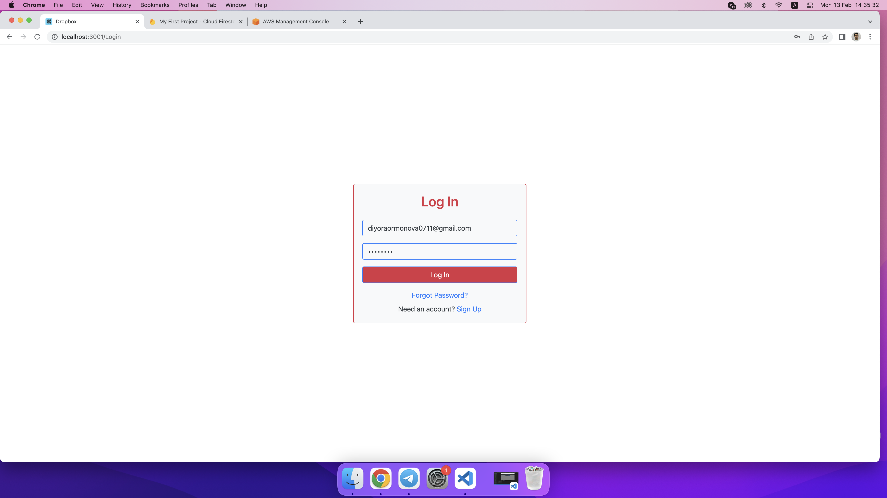

# Welcome Dropbox
Welcome to my project <a href="https://diyora-dropbox.netlify.app/">Dropbox</a>

## Usage

- Diyora [@urmonovadiyora](https://github.com/urmonovadiyora)
- Shaxzod [@samiyev63](https://www.github.com/samiyev63)

## Demo
https://diyora-dropbox.netlify.app/

## Task 
- Auth
- Create Folder
- Create File
- Upload Files
- View Profile
- Edit Profile

## Installation
first you need install node. For install you need write in terminal
```
npm i
```
and write for run
```
npm start
```

## Description
Dropbox is a file hosting service operated by the American company Dropbox, Inc., headquartered in San Francisco, California, that offers cloud storage, file synchronization, personal cloud, and client software.

# Dropbox Photos




### The Core Team
O'rmonova Diyora urmonova_d and Samiyev Shaxzod samiyev_s

<span><i>Made at <a href='https://qwasar.io'>Qwasar SV -- Software Engineering School</a></i></span>
<span></span>
